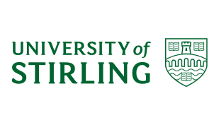

---
title: 研究知情同意书
---

欢迎参加该实验！实验开始前，请您同意以下事项：

1. 本研究的结果将会被匿名化安全保存，只有本研究组的成员能看到研究结果。

2. 本研究的的结果可能会在学术期刊/书籍/会议上发表，但您的名字或者其他可以确认您身份的信息将不会在任何发表的材料中出现。

3. 您的参与完全基于自愿的原则，您可以在实验的任何过程中要求退出，并且您不会因为退出实验而受到处罚或损失。

4. 您已阅读并了解该研究的目的、过程，且明白该研究没有已知的危险。

5. 您已经详细阅读了本被试同意书。
